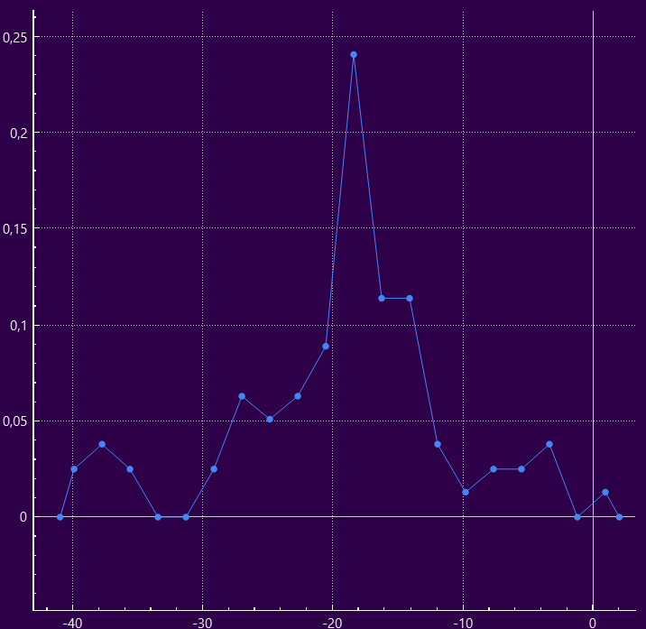
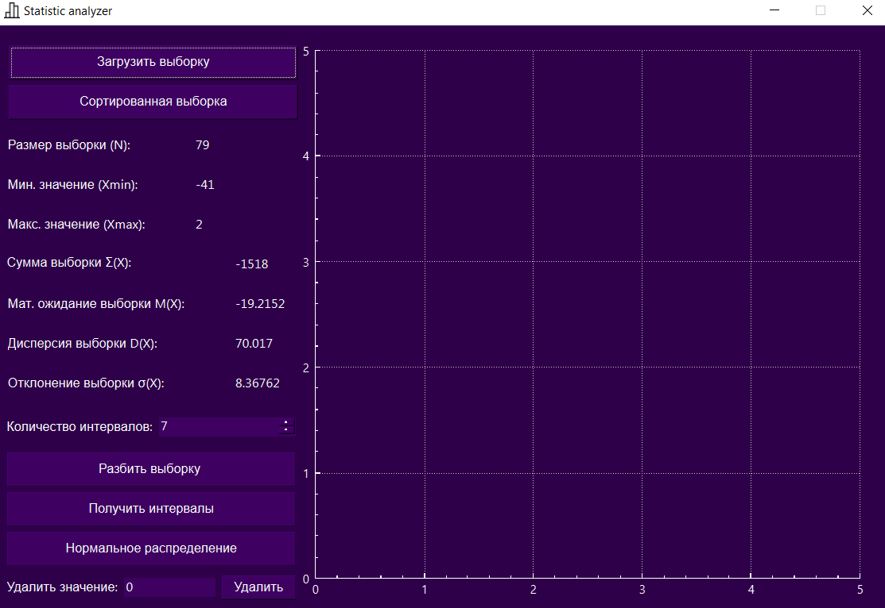
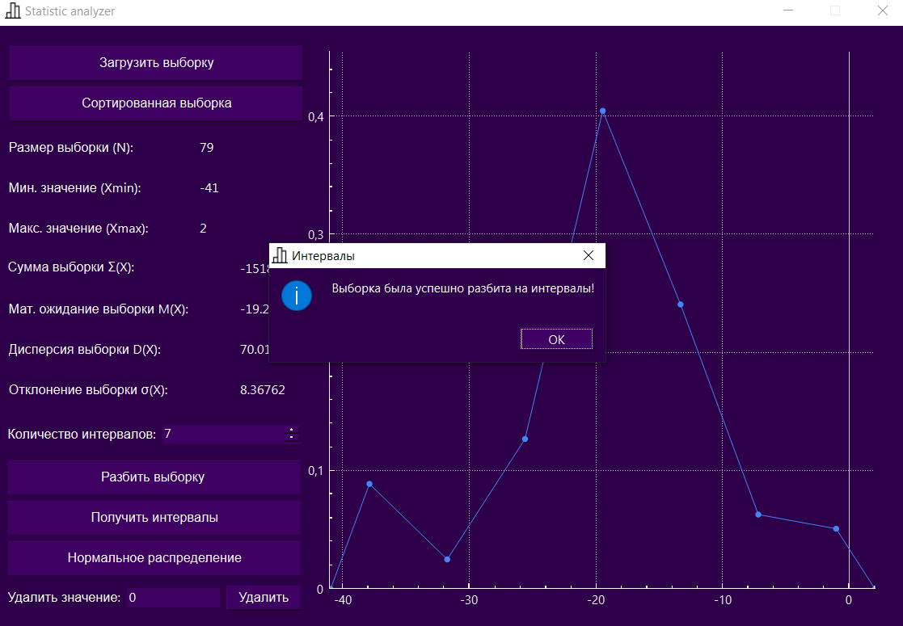
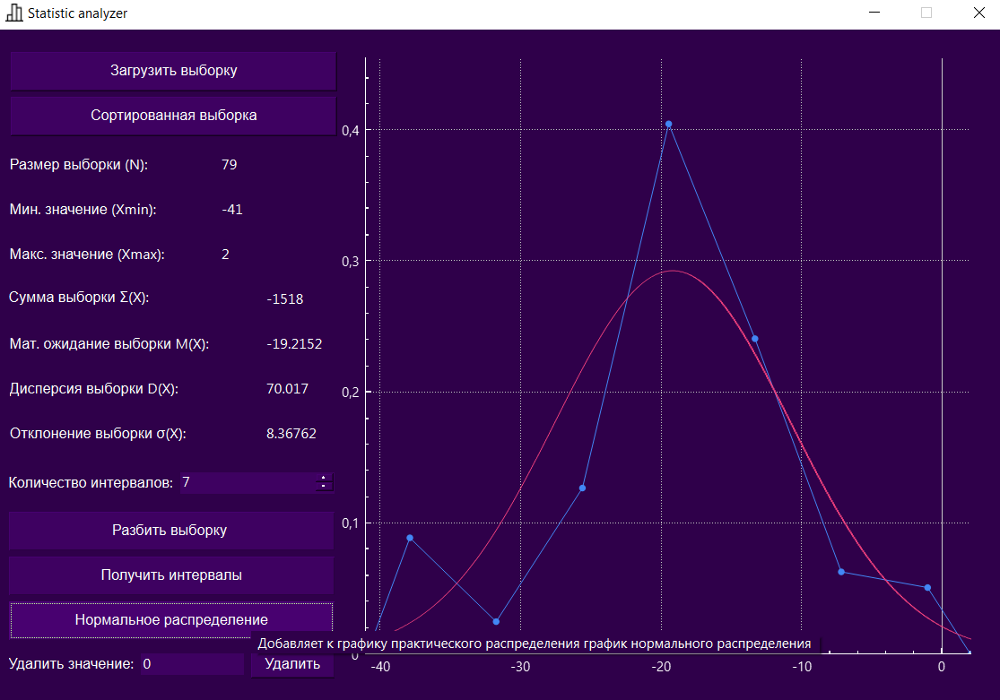
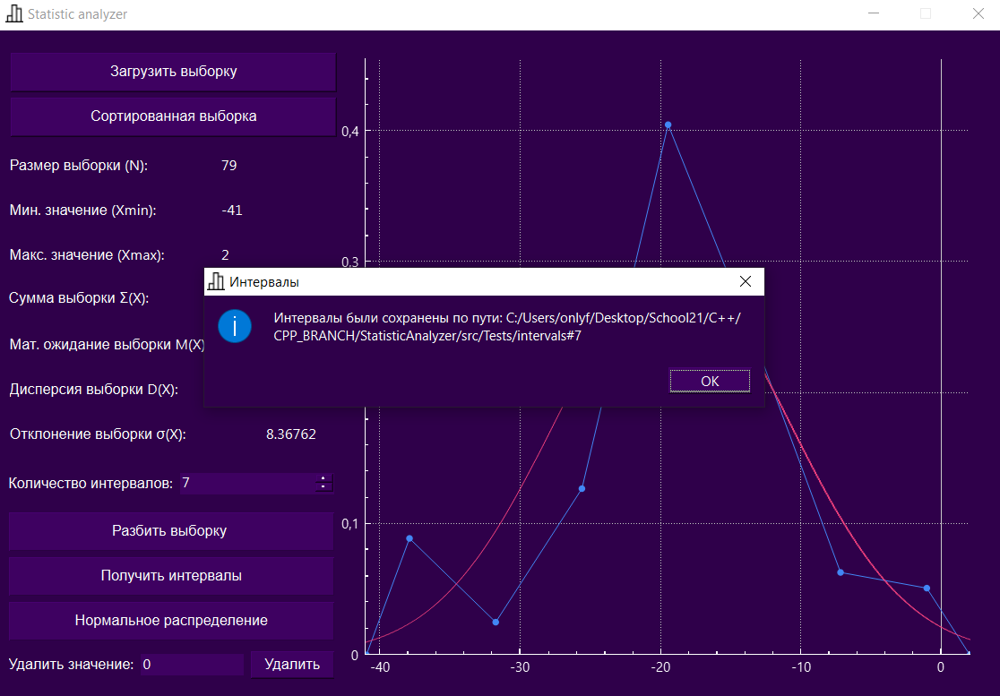
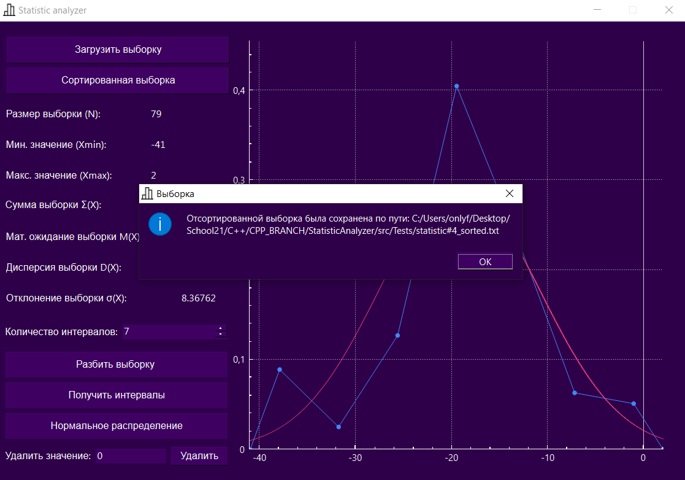

# STATISTIC ANALYZER by tonitaga

---

## Contents

1. [Developers](#developers)
2. [Project idea](#project-idea)
3. [How it looks like?](#how-it-looks-like)
4. [QCustomPlot](#qcustomplot)

---

---

### Developers:
- Gubaydullin Nurislam

---

### Project idea

* The main idea was to automate the performance of laboratory work at the Kazan Aviation Institute on the subject of Fundamentals of Mechanical Engineering Technology
* The implementation of this application was prompted by the love of his classmates and the love of mathematics

---

### How it looks like?

* The file with the extension is taken as a basis .txt, where the sample data is written separated by a space or on a new line
* The application reads the sample from the file and calculates the basic data of mathematical statistics for the current sample

* By clicking the "Разбить выборку" button, having previously selected a little higher by how many intervals, you can get a graph of the practical distribution over the intervals of the current sample

* By clicking the "Нормальное распределение" button, having built a practical distribution graph in advance, a graph of the reduced (to the practical graph) normal distribution will be built

* By clicking the "Получить интервалы" button, after splitting the sample into intervals in advance, you can get a file with intervals in the format .txt

* By clicking the "Сортированная статистика" button, you can get a file with a sorted selection in the format .txt

---

### QCustomPlot

* Graphs are built using the QCustomPlot library
* Developers' website [QCustomPlot](https://www.qcustomplot.com/)

---

#### © tonitaga (Gubaydullin Nurislam) 29.05.2023